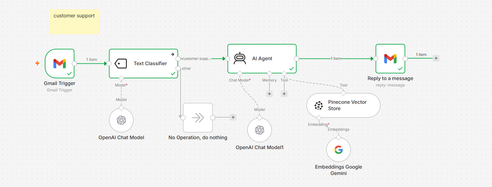
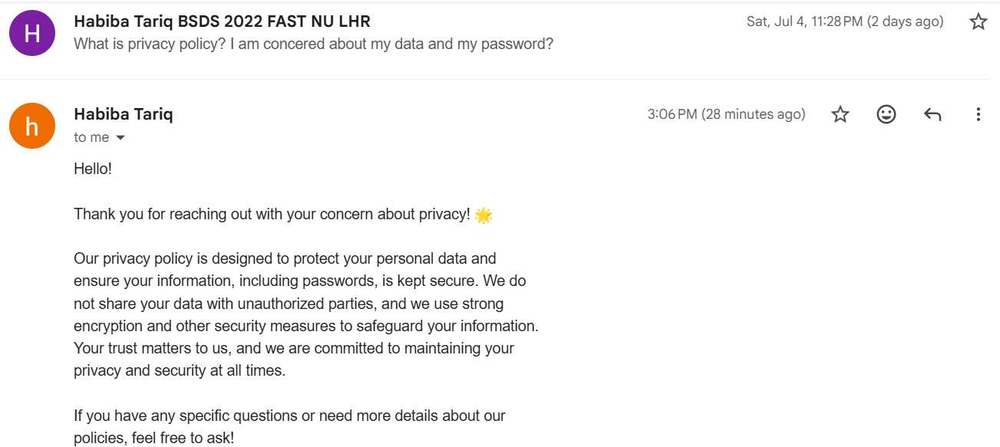

# 🤖 AI Customer Support RAG Agent (n8n)

An automated customer support system built with **n8n** that reads incoming Gmail messages, classifies them, retrieves accurate answers from company policy/FAQ documents using **RAG (Retrieval-Augmented Generation)**, and sends a grounded, AI-generated reply — automatically.

---

## 📋 Overview

This workflow automatically:
1. Listens for incoming Gmail messages via **Gmail Trigger**
2. Classifies each email as **"customer support"** or **"other"** using a Text Classifier
3. Passes support queries to an **AI Agent** with memory and tool access
4. Retrieves relevant context from a **Pinecone vector store** (RAG) using **Google Gemini embeddings**
5. Generates a grounded reply and sends it back via **Gmail**

No manual triage. No hallucinated answers — every reply is backed by real, retrievable documents (e.g. privacy policy, FAQs).

---

## 🏗️ Workflow

| Node | Purpose |
|---|---|
| **Gmail Trigger** | Watches inbox for new incoming emails |
| **Text Classifier** | Routes emails into "customer support" vs "other" using an OpenAI Chat Model |
| **No Operation** | Silently ignores emails classified as "other" |
| **AI Agent** | Core reasoning engine — decides how to respond, with memory + tool access |
| **Pinecone Vector Store** | Retrieves relevant policy/FAQ context (RAG) as a callable tool for the agent |
| **Embeddings (Google Gemini)** | Converts text into vector embeddings for similarity search |
| **Reply to a Message** | Sends the AI-generated response back to the customer via Gmail |

---

## 💬 Example in Action

**Incoming email:**
> "What is privacy policy? I am concerned about my data and my password?"

**Auto-generated reply:**
> Hello!
>
> Thank you for reaching out with your concern about privacy!
>
> Our privacy policy is designed to protect your personal data and ensure your information, including passwords, is kept secure. We do not share your data with unauthorized parties, and we use strong encryption and other security measures to safeguard your information. Your trust matters to us, and we are committed to maintaining your privacy and security at all times.
>
> If you have any specific questions or need more details about our policies, feel free to ask!

The reply above was generated entirely by the AI Agent, grounded in the actual privacy policy document stored in Pinecone — not a generic canned response.

---

## ⚙️ Tech Stack

- **[n8n](https://n8n.io)** — workflow automation & orchestration
- **OpenAI** — chat model for classification + agent reasoning
- **Google Gemini** — free-tier embeddings for the RAG pipeline
- **Pinecone** — vector database for document retrieval

---

## 🚀 Setup

### Prerequisites
- An [n8n](https://n8n.io) instance (cloud or self-hosted)
- A Gmail account with API access configured in n8n
- An [OpenAI API key](https://platform.openai.com/api-keys) (billing enabled)
- A [Google AI Studio API key](https://aistudio.google.com/apikey) (free tier)
- A [Pinecone](https://app.pinecone.io) account + index

### Steps
1. Import `workflow.json` into your n8n instance.
2. Configure credentials for:
   - Gmail (OAuth2)
   - OpenAI (Chat Model + Text Classifier)
   - Google Gemini (Embeddings)
   - Pinecone (Vector Store)
3. Upload your policy/FAQ documents into your Pinecone index.
4. Activate the workflow.
5. Send a test email to the connected Gmail account and watch the pipeline run end-to-end.

---

## ⚠️ Notes & Gotchas

- **Embedding dimension mismatch:** If you switch embedding providers (e.g., OpenAI ↔ Gemini) after your Pinecone index is already populated, make sure the new provider's embedding dimensions match your index config — otherwise retrieval will fail.
- **OpenAI 429 errors:** Usually mean your OpenAI account has no billing/payment method set up. Check [platform.openai.com/settings/organization/billing](https://platform.openai.com/settings/organization/billing/overview).
- **Data sensitivity:** If using OpenAI's data-sharing free-token program, don't enable it on workflows handling sensitive customer data.

---

## 📈 Possible Improvements

- [ ] Add a fallback model/provider if the primary AI service is rate-limited
- [ ] Add logging/analytics on classification accuracy
- [ ] Support multi-language auto-replies
- [ ] Add human-in-the-loop approval step before sending replies

---

## 📄 License

MIT — feel free to fork, adapt, and build on this.

---

## 🙋 About This Project

Built as a hands-on exploration of AI agent orchestration, RAG pipelines, and workflow automation using n8n.
